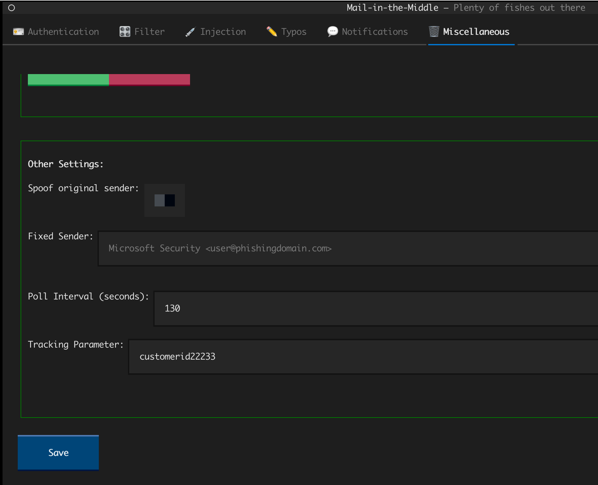

Summary
=======

<p align="center">
  
</p>

This script sits in the middle between a legitimate sender of an email and the legitimate recipient of that email. This means that we (the attackers) are receiving sensitive information not originally destined to us. I like to call these emails "Stranded emails".

The way we sit in the middle of these two parts are by taking advantage of the typos the sender of the email commits. The attacker needs to register multiple domains with typos of the target company, or what is usually called, [typosquatted](https://www.kaspersky.com/resource-center/definitions/what-is-typosquatting) domains. 

Once the typosquatted domains are on the attacker's hands, they should [configure an MX](https://www.namecheap.com/support/knowledgebase/article.aspx/322/2237/how-can-i-set-up-mx-records-required-for-mail-service/) entry on their DNS entries to redirect the emails to their mail server (e.g. mail.attackerdomain.com). Then, the mail server have to be configured with a [catch-all](https://tecadmin.net/setup-catch-all-email-account-in-postfix/) rule to receive all emails in a single inbox (e.g. attacker@attackerdomain.com).

This script connects to the attacker mail server (mail.attackerdomain.com) and lists the emails being received there following a set of rules (filter rules). All the emails that match the filter will be forwarded to their legitimate recipients, but with a pinch of evilness. This means that we can modify the contents of the email, including attachments, links, tracking pixels, and other content. This opens an avenue to send phishing links or C2 beacons to users that are actually expecting an email with that content, thus, increasing our oportunities to get interactions with the targets.

Architecture
============
A picture is worth a thousand words.

Green email means "untainted" email. Red email means "tainted" email with attacker's controlled links, attachements, and content:


# Usage

## Configuration

Open the file "config/config.yml", configure the name of the files containing the sub-configuration files:
* auth: Contains the authentication information to login the SMTP and IMAP servers
* typos: Contains the rules to fix the typos in specific email addresses or domains
* filter: Contains the filtering settings of what emails to forward and poison
* injections: Contains the behaviour of the program regarding injecting tracking URLs, UNC paths and attachments
* misc: Contains various settings, including the source and destination addresses, and the interval to poll the mail boxes.
* notifications: Contains settings for Discord and Teams notification.
* logging: Contains the configuration of the logger.

For detailed information about how to configure each of these sub-configuration files, refer to the section ["Configuration files"](#configuration-files).

## Execution
Once the configuration has been done, you can invoke the script using docker or by installing the dependencies with pipenv. You can use the CLI version of the tool, or the Textual User Interface (TUI).

## Flags
Use the flag "-f" to forward the emails for real (without this flag, the script would only  monitor the incoming emails and send them to the Discord/Teams chat).

The flag "-n" is important if you only want to monitor the "new" emails. If not specified, all the historic emails would be retrieved from the inbox on execution on every loop, so you would end up sending the same emails in each iteration of the polling loop. Use "-n" in production. Do not user if you want to test the script.

The flag "-c" is to provide alternative configuration files.

### Docker Execution
Build and execute the container by running this:
```bash
docker build -t maitm .       # Build
docker run --rm -ti maitm -h  # To get help
docker run --rm -ti maitm -c config/config.yml -f -n # To forward the emails and only forward newest emails
# If you want to use your own configuration files and attachment folder you can map a volume for that:
docker run -it --rm -v $(pwd)/config:/Maitm/config -v $(pwd)/attachments:/Maitm/attachments maitm cli -n -f -c config/myconfig.yml
```

Or alternatively get the package from ghcr.io:
```bash
docker pull ghcr.io/sensepost/mail-in-the-middle/maitm:latest
docker tag ghcr.io/sensepost/mail-in-the-middle/maitm:latest maitm
```

## TUI

There is a Textual User Interface (TUI) of the tool that you can invoke by using the option "tui" instead of "cli":

```bash 
docker run -it --rm maitm tui
```

The TUI will allow you to run the tool by clicking the big Green button.
The main screen looks like the following:


You can select the configuration section by clicking the "configuration" button or pressing the "c" key.
The configuration section has six different tabs.

The 'Authentication' tab allows you to define the protocols and credentials to be used for outbound and inbound emails:


The 'Filter' tab allows you decide what emails you want the tool to act upon and forward. You can define the date since maitm will start looking for emails, if you want to ignore read emails or not, and the criteria to monitor or ignore. You can monitor/ignore some subjects, destination domains and source domains:


The 'Injection' tab allows you to define what do you want to do with the selected emails, for example if you want to replace 'all' links or just links directing to a specific domain (top level domain). It also allows you to define headers to be injected, files to attach, and invisible tracking pixel and UNC links:


The 'Typos' tab allow you to define the rules to correct the mistiped domains. You can fix the domain or you can fix individual addresses:


The 'notifications' tab will let you define the Teams and Discord webhook where you will receive notifications about emails forwarded, so you can wake up from your siesta and act on those emails.

Finally, the 'Miscellaneous' section allows you to define testing emails within the field "Fixed destinations". If something is defined in this box, the emails will not go to the corrected emails, but rather to your testing email addresses. It also allows you to define whether you want to spoof the source email address, define a fixed sender, a poll interval and the name of the tracking parameter injected in all the phishing links:





### Pipenv Execution

Install pipenv on your environment, the dependencies and run:

```bash
apt install pipenv
pipenv install --python=3.12
pipenv shell
./mail-in-the-middle.py cli -n -f -c config/config.yml
```

Configuration files
===================

To see examples of the files, go to the folder config.

config.yml
----------
Root configuration file. It has one entry per sub-configuration file. The default content is:

```yaml
auth: auth.yml
filter: filter.yml
injections: injections.yml
misc: misc.yml
notifications: notifications.yml
typos: typos.yml
```

If you want to have multiple configuration files you can create conf-prod.yml, conf-dev.yml, conf-test.yml, etc. and modify single values in this structure, such as the auth or filter.

typos.yml
---------
These are the rules that Mail-in-the-middle follow to correct the destination email address and forward the tained email. We can define specific email addresses or whole domains. 
For example, if we want to fix a typo in the email felipe@mydomani.com and forward to felipe@mydomain.com and we want to forward emails sent to mircosoft.com, and micrrosoftr.com and send them to users of microsoft.com, we write the following:
```yaml
address:
  felipe@mydomani.com: felipe@mydomain.com
domain:
  mircosoft.com: microsoft.com
  micrrosoftr.com: microsoft.com
```

filter.yml
----------
The file allows you to define what emails are forwarded and tainted with your links and content. The following root parameters can be defined:
* **monitor**: A dictionary containing the criteria of what to monitor in loop. The keys you can use here are:
  * **from_domains**: A list of domains of the emails specified in the "From" field of the email.
  * **to_domains**: A list of domains of the emails specified in the "To" field of the email.
  * **subject**: A list of subjects of emails to forward. Like "OTP", "Registration", etc.
* **ignore**: A dictionary containing the criteria of what to ignore, like a deny-list of things you don't want to forward:
  * **to_domains**: A list of domains of the emails specified in the "To" field of the email to ignore.
  * **from_domains**: A list of domains of the emails specified in the "From" field of the email to ignore.
  * **subjects**: A list of Subjects to ignore. If any of the previous filter matches (from_domains, to_domains, subject_srt), the email will not be forwarded if it contains the strings defined here.
  * **seen_email**: A boolean indicating whether we should ignore already read emails or not.
* **date_limit**: A UTC date with the format YYYY-MM-DD HH:mm:ss+00.Forward emails only if are more recent than this date.

auth.yml
--------
Contains two main sections: 
* **send**: Two protocols can be used to send out emails: Microsoft O365 **oauth2legacy** or **smtp**. To use Microsoft O365 oauth2 legacy, refer to https://learn.microsoft.com/en-us/entra/identity/enterprise-apps/grant-admin-consent?pivots=portal#construct-the-url-for-granting-tenant-wide-admin-consent
* **read**: Two protocols can be used to read emails form your catchall email server: **imap** or **oauth2legacy**.
An example configuration file using smtp for sending out emails and imap for reading emails from your inbox looks like this:
```yaml
send:
  oauth2legacy:
    email: <user@phishingdomain.com>
    password: <userpassword>
    client_id: <your client id>
    client_secret: <your client secret>
    tenant_id: <your tenant id>
read: 
  imap:
    username: <usercatchall@catchallserver.com>
    password: <usercatchallpassword>
    server: <imap.catchallserver.com>
    port: 993
    ssl: True
```

If you want to use smtp instead of oauth2 legacy, your file would look similar to this:
```yaml
send:
  smtp:
    username: <user@phishingdomain.com>
    password: <userpassword>
    server:  <smtp.yourdomain.com>
    port: 587
    tls: True
read: 
  imap:
    username: <usercatchall@catchallserver.com>
    password: <usercatchallpassword>
    server: <imap.catchallserver.com>
    port: 993
    ssl: True
```

injections.yml
--------------
Define what to do with the email content.
It has four root keys:
* **tracking_url**: The URL of your tracking pixel. It gets injected at the beggining of the email within an `````` tag. 
* **unc_path**: The UNC path to exfiltrate NetNTLM tokens of your targets. It gets injected at the beggining of the email within an `````` tag.
* **attachments**: It defines what to do with the attachments of the emails. If it is defined, it will replace the original attachment of the email or inject a new one if there was none. It has to contain the following attributes:
    * **path**: Path to our attachement.
    * **attachment_message**: HTML code to introduce at the beggining of the email to instruct your targets how to unzip and execute your payload ;-)
* **links**: It defines what to do with the original links of the email. It can contain the following attributes:
    * **all**: A URL with which ALL the links of the email will be replaced. 
    * **<domain.com>**: The first level domain of the links in the email that will be replaced with your URL. You can define more than 1. E.g. if you define office.com: https://attacker.com/notaphish.html, only the links pointing to \*.office.com/\* will be replaced with the attacker's defined link.

notifications.yml
-----------------
Two keys. One for "teams", other for "discord". Both optional.
If you want to send a message to your Teams and Discord chats, your file would look like this:
```yaml
teams: "https://<yourcompany>.webhook.office.com/webhookb2/<etc>"
# Testing discord
discord: "https://discord.com/api/webhooks/<id>"
```

License
=======
Maitm is licensed under a [GNU General Public v3 License](https://www.gnu.org/licenses/gpl-3.0.en.html). Permissions beyond the scope of this license may be available at http://sensepost.com/contact/.

Feedback
========
PRs are welcome. Please, let me know of any other ideas or suggestions via twitter [@felmoltor](https://twitter.com/felmoltor).

Original Idea
=============
Intercepting mail using this method was originally spearheaded internally by [Willem Mouton](https://twitter.com/_w_m__). Szymon Ziolkowski ([@TH3_GOAT_FARM3R](https://twitter.com/TH3_GOAT_FARM3R)) proposed the automation that Felipe Molina ([@felmoltor](https://twitter.com/felmoltor)) then implemented and expanded on.
